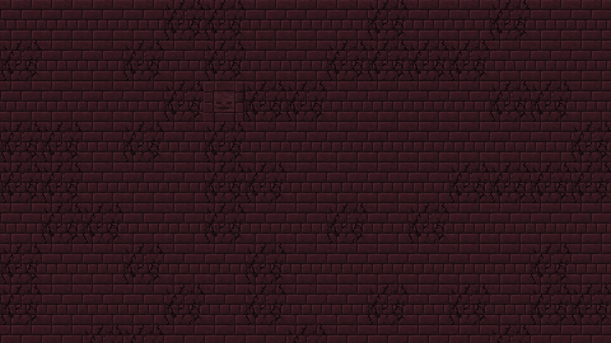

# Minecraft wallpaper generator

#### This program renders wallpaper created from individual block textures.
##### It supports any texture including these from resource packs.

## Example:
```
mc-wallpaper-generator --action transform-random --scale 4 --from nether_bricks.png,cracked_nether_bricks.png,chiseled_nether_bricks.png --probabilities 70,30,1 --to result.png
``` 
##### This command generates random image like this:

###### Used textures belong to [Faithful resource pack](https://faithful.team). I don't own any textures.

## Change you wallpaper everytime you turn on the computer
##### You can add the script to autostart on your computer to generate new random wallpaper everytime you start it.
##### It's also possible to change wallpaper once an hour (or any different duration) by adding the script into crontab.
